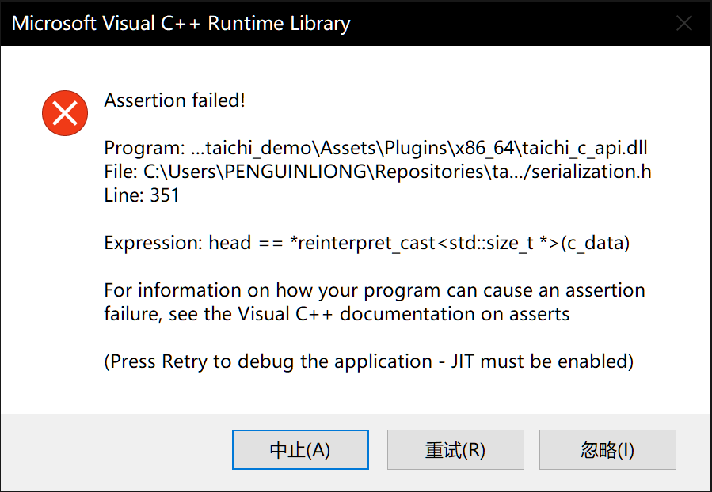
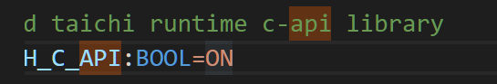
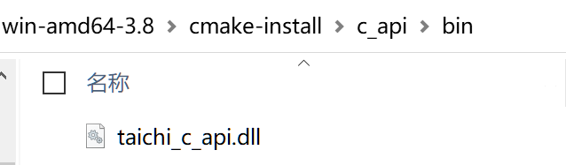
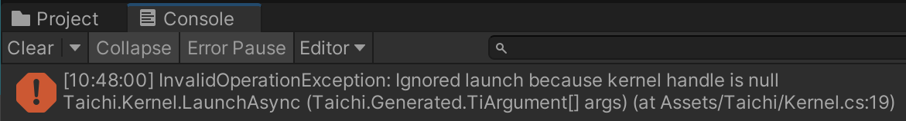

# Taichi-UnityExample

This repository demonstrates Taichi-Unity interopability with sample scenes.

🔥 The Unity examples are still in active development. Things can break sometimes but will be fixed real soon.

 

## Prerequisites

If you have installed any recent version of Unity (2022.3.14 or above), this project is runnable out-of-the-box. You don't need to build taichi libraries because all the necessary native plugins are already included in `Assets/Plugins`, but in case you want to, consult [taichi-dev/taichi](https://github.com/taichi-dev/taichi) and [taichi-dev/taichi-unity2](https://github.com/taichi-dev/taichi-unity2) for building manuals.

If you want to create another Unity Project with Taichi integration, you need to set your first-choice graphics API to Vulkan in *Player Settings* in Unity because currently Taichi C-API doesn't support other graphics APIs at the moment.

## Packaging

You can head for `File - Build Settings` to configurate and package the game application. Currently the examples can only be build for Android and Windows PC using the Vulkan API. Please refer to [Unity documentations](https://docs.unity3d.com/Manual/BuildSettings.html) for detail. Prebuilt releases could be found on [the release page](https://github.com/taichi-dev/Taichi-UnityExample/releases).

## Content

This repository presents several demo scenes, each can be found in `Assets/Scenes`:

- `Fractal`: A simple time-dependent texture generation kernel;
- `ImplicitFem`: A physically-based soft-body simulation emitting vertex data on-the-flight.

Also note that the project can be built into Unity Player.

## Notes for Android

Note that some player settings are changed for Android

- Minimum version is changed to 26 (Android Oreo), which is the version the native libraries are compiled;
- Scripting backend is switched to IL2CPP;
- Library arch is set to `ARM64`, support for `ARMv7` is canceled;
- Default orientation is fixed portrait.

## Run the demo
This demo may not run directly on your device. So we have listed some of the problems you may encounter here.

- **If you get the follow popup when trying to run:**

This means that you need to regenerate the `taichi_c_api.dll` and `taichi_unity.dll` files and put them in the `Assets/Plugins/X86_64`.

Among them, the generation of taichi_c_api.dll is completed during the source code compilation process of taichi. if you can't find `c_api` folder under `.\taichi\_skbuild\win-amd64-3.X\cmake-install`. You should set the H_C_API option to ON in the CmakeCache.txt file under the `.\taichi\_skbuild\win-amd64-3.X\cmake-build`. 

After recompiling, you can find the dll file in the c_api folder mentioned earlier.

You can get `taichi_unity.dll` from [taichi-dev/taichi-unity2](https://github.com/taichi-dev/taichi-unity2) in a similar way.

In this way, our demo will no longer crash :).

- **If you get the follow Exception when trying to run:**

This means that we need to regenerate the compute graph.

For fractal demo, we only need to run the `fractal.cgraph.py` and `fractal.kernel.py` in the `.\scripts` path, and close it after successful operation.

For implicit_fem demo, we have to make sure that the `--aot` parameter in the corresponding .py file is set to **True**. Then the next steps are the same as the fractal demo.
